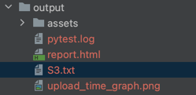
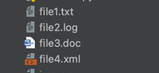
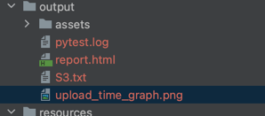
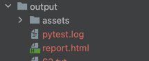

# aws-s3-automation

This is the test automation project based on Python with pytest framework. The test module contains multiple e2e cases to verify different aws s3 operations. Boto3(AWS SDK for Python) library is used to access various resources in AWS.

**pre-requisites**

Need AWS account(at least free tier) & 1 IAM user with policy AmazonS3FullAccess to perform all CRUD operation on AWS s3. Generate Access key for this user.

# Project Structure

Here you can find a short description of main directories and it's content

* **data** - Inside this folder we have file(config.py) for storing static data e.g. bucket_name, file_name etc & auth_key.py for encrypted aws access_key details.

* **resources** - Inside this folder we have helper_s3_func.py to store all s3 related operational functions.
* **test** - There is single test file inside this folder contains the actual test methods to do below use cases

1. Create a aws s3 bucket
2. Upload a text file
3. Download the text file
4. Delete the text file
5. Prepare a report for file upload performance, data visulization methods are preferred

* **output** - This folder will generate on runtime to store execution logs, default pytest html report & downloaded file & saved image.

# Project Features

* It follows pytest framework. pytest related Configuration settings are added in "pytest.ini" file. execution logs are found in "pytest.log" file
* For accessing AWS resources, it uses Boto3 library.
* In auth_key.py, AWS access key & secret are stored in base64(utf8) encrypted format you can encrypt keys in this link - [https://pr.gg/base64/](https://pr.gg/base64/) . In pytest fixture under conftest.py file, we decrypt the secret & use it to create s3 resource.
* All the output files(test logs, report, downloaded file, generated image) are stored inside the /output folder

* For accessing python data visulization utilities, matplotlib library is being used & the bar graph plot is called to generate reports against the given input files.

Input files

output report

# Getting Started

To run the test, just download the project or clone repository. You need to install packages using pip according to requirements.txt file. Run the command below in terminal:

`$ pip install -r requirements.txt`

# Run Tests

The test uses pytest framework, to run all available tests from cmd use below command

`$ pytest`

To run any specific test use below command

`$ pytest test/${test_file_name}::${test_mehod_name}`

e.g.

`$ pytest test/test_mega_s3_assignment.py::test_download_file_from_s3_bucket`
# Generate Report

below command can be used to generate pytest default html report, which will be stored as below structure

`$ pytest --html=output/report.html`

`$ pytest --html=report.html test/test_mega_s3_assignment.py::test_download_file_from_s3_bucket`

